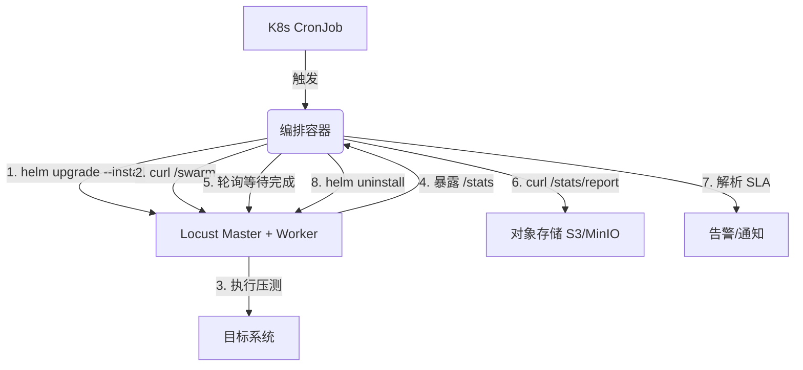

# 定时任务与夜间回归压测调度

相比 MR 门禁的“轻量快速验证”，夜间回归压测承担的是**全链路、长周期、高并发**的深度探测任务。它不仅要跑完脚本，还必须具备**自动化调度、资源生命周期管理、结果持久化存储以及智能告警**能力。

在 Kubernetes 环境下，最契合的方案是 **CronJob + Helm + 编排脚本**。以下是生产级的落地方案。

---

### 一、架构设计：Operator 模式

我们**不**直接在 CronJob 中运行 `locust`，而是运行一个**编排容器（Orchestrator）**。该容器具备 K8s 操作权限，负责 Locust 集群的**部署、启动、监控、采集与销毁**。



### 二、核心编排脚本实现（Python）

将编排逻辑封装为 Docker 镜像，由 CronJob 触发执行。

```python
# orchestrator.py
import os
import time
import json
import requests
import subprocess
import sys
from datetime import datetime

# --- 配置参数（由环境变量注入）---
NAMESPACE = os.getenv("LOCUST_NAMESPACE", "perf-nightly")
RELEASE_NAME = os.getenv("LOCUST_RELEASE", "locust-nightly")
HELM_CHART = os.getenv("HELM_CHART", "./helm/locust")  # Locust Helm Chart 路径
TARGET_HOST = os.getenv("TARGET_HOST")
USERS = int(os.getenv("USERS", "1000"))
SPAWN_RATE = int(os.getenv("SPAWN_RATE", "100"))
RUN_TIME = os.getenv("RUN_TIME", "30m")  # 夜间测试时长
SLA_FAILURE_RATE = float(os.getenv("SLA_FAILURE_RATE", "1.0"))
SLA_P95_MS = int(os.getenv("SLA_P95_MS", "500"))
S3_BUCKET = os.getenv("S3_BUCKET", "perf-reports")
SLACK_WEBHOOK = os.getenv("SLACK_WEBHOOK")

def run_shell(cmd):
    print(f"Exec: {cmd}")
    return subprocess.run(cmd, shell=True, capture_output=True, text=True)

def deploy_locust():
    """1. 部署或升级 Locust 集群"""
    cmd = (f"helm upgrade --install {RELEASE_NAME} {HELM_CHART} -n {NAMESPACE} "
           f"--create-namespace --wait "
           f"--set master.resources.requests.cpu=500m "
           f"--set worker.replicas=0 "  # 先不启动 Worker
           f"--set env.TARGET_HOST={TARGET_HOST}")
    return run_shell(cmd)

def scale_workers(replicas):
    """2. 扩展 Worker 数量"""
    return run_shell(f"kubectl scale deployment {RELEASE_NAME}-worker -n {NAMESPACE} --replicas={replicas}")

def wait_for_workers_ready(timeout=120):
    """3. 等待 Worker Pods 就绪"""
    start = time.time()
    while time.time() - start < timeout:
        res = run_shell(f"kubectl get deployment {RELEASE_NAME}-worker -n {NAMESPACE} -o json")
        if res.returncode == 0:
            status = json.loads(res.stdout)
            ready = status.get("status", {}).get("readyReplicas", 0)
            desired = status.get("status", {}).get("replicas", 0)
            if ready == desired and ready > 0:
                return True
        time.sleep(5)
    return False

def start_load_test():
    """4. 通过 Master API 启动压测"""
    # 先做 Port-forward 或直接访问 Service
    master_svc = f"{RELEASE_NAME}-master.{NAMESPACE}.svc.cluster.local"
    url = f"http://{master_svc}:8089/swarm"
    payload = {
        "user_count": USERS,
        "spawn_rate": SPAWN_RATE,
        "host": TARGET_HOST
    }
    try:
        resp = requests.post(url, json=payload, timeout=10)
        return resp.status_code == 200
    except Exception as e:
        print(f"Start test failed: {e}")
        return False

def wait_for_test_completion():
    """5. 轮询 Master 状态，直到测试结束或超时"""
    master_svc = f"{RELEASE_NAME}-master.{NAMESPACE}.svc.cluster.local"
    state_url = f"http://{master_svc}:8089/stats/state"
    # 给测试额外 5 分钟缓冲
    timeout = int(RUN_TIME.replace("m", "")) * 60 + 300
    start = time.time()
    while time.time() - start < timeout:
        try:
            resp = requests.get(state_url, timeout=5)
            if resp.status_code == 200 and resp.json().get("state") == "stopped":
                return True
        except:
            pass
        time.sleep(10)
    return False

def collect_results():
    """6. 下载 HTML 报告和 CSV 统计"""
    master_svc = f"{RELEASE_NAME}-master.{NAMESPACE}.svc.cluster.local"
    report_url = f"http://{master_svc}:8089/stats/report"
    csv_url = f"http://{master_svc}:8089/stats/requests/csv"
    
    timestamp = datetime.now().strftime("%Y%m%d_%H%M%S")
    
    # 下载 HTML
    resp = requests.get(report_url)
    with open(f"report_{timestamp}.html", "wb") as f:
        f.write(resp.content)
    
    # 下载 CSV
    resp = requests.get(csv_url)
    with open(f"stats_{timestamp}.csv", "wb") as f:
        f.write(resp.content)
    
    return f"report_{timestamp}.html", f"stats_{timestamp}.csv"

def validate_sla(csv_file):
    """7. 解析 CSV 验证 SLA（使用 pandas）"""
    import pandas as pd
    df = pd.read_csv(csv_file)
    total = df[df['Name'] == 'Aggregated'].iloc[0]
    
    failure_rate = total['Fails'] / total['Requests'] * 100
    p95 = total['95%ile']
    
    passed = (failure_rate <= SLA_FAILURE_RATE) and (p95 <= SLA_P95_MS)
    return passed, failure_rate, p95

def send_slack_notification(status, report_file, failure_rate, p95):
    """8. 发送通知（可选）"""
    if not SLACK_WEBHOOK:
        return
    color = "good" if status else "danger"
    text = (f"*Nightly Performance Test*\n"
            f"Status: {'✅ Passed' if status else '❌ Failed'}\n"
            f"Failure Rate: {failure_rate:.2f}%\n"
            f"P95: {p95:.0f}ms\n"
            f"Report: {report_file}")
    requests.post(SLACK_WEBHOOK, json={"text": text, "attachments": [{"color": color, "text": text}]})

def cleanup():
    """9. 清理资源（无论成败）"""
    run_shell(f"helm uninstall {RELEASE_NAME} -n {NAMESPACE} || true")
    # 可选：删除 Namespace 以彻底清理
    # run_shell(f"kubectl delete namespace {NAMESPACE}")

# -------- 主流程 ----------
if __name__ == "__main__":
    try:
        print("🚀 Deploying Locust...")
        deploy_locust()
        
        print("⚙️ Scaling workers...")
        # 计算 Worker 数量：假设每个 Worker 可支撑 200 用户
        worker_count = max(1, USERS // 200)
        scale_workers(worker_count)
        
        if not wait_for_workers_ready():
            raise Exception("Workers not ready")
        
        print("🏁 Starting load test...")
        if not start_load_test():
            raise Exception("Failed to start test")
        
        print("⏳ Waiting for test completion...")
        if not wait_for_test_completion():
            raise Exception("Test timeout")
        
        print("📊 Collecting results...")
        html_file, csv_file = collect_results()
        
        print("🔍 Validating SLA...")
        passed, fr, p95 = validate_sla(csv_file)
        send_slack_notification(passed, html_file, fr, p95)
        
        # 上传到 S3（示例）
        # import boto3; boto3.client('s3').upload_file(html_file, S3_BUCKET, html_file)
        
        if not passed:
            print(f"❌ SLA Failed: FR={fr:.2f}%, P95={p95}ms")
            sys.exit(1)
        else:
            print("✅ All SLA passed")
            
    except Exception as e:
        print(f"❌ Error: {e}")
        send_slack_notification(False, "Error", 0, 0)
        sys.exit(1)
    finally:
        print("🧹 Cleaning up...")
        cleanup()
```

---

### 三、Kubernetes CronJob 配置

```yaml
# cronjob-nightly-perf.yaml
apiVersion: batch/v1
kind: CronJob
metadata:
  name: nightly-perf-test
  namespace: perf-system
spec:
  # 每天凌晨 2:00 (UTC) 执行
  schedule: "0 2 * * *"
  concurrencyPolicy: Forbid        # 不允许重叠运行
  startingDeadlineSeconds: 600     # 10 分钟内未启动则跳过
  successfulJobsHistoryLimit: 3
  failedJobsHistoryLimit: 3
  jobTemplate:
    spec:
      backoffLimit: 1              # 失败后仅重试一次
      ttlSecondsAfterFinished: 3600 # 完成后 1 小时自动清理 Pod
      template:
        spec:
          serviceAccountName: locust-orchestrator  # 拥有 Helm/K8s 权限
          restartPolicy: Never
          containers:
          - name: orchestrator
            image: your-registry/locust-orchestrator:v1  # 打包了上述 Python 脚本
            imagePullPolicy: Always
            env:
            - name: TARGET_HOST
              value: "https://prod-api.example.com"
            - name: USERS
              value: "5000"
            - name: RUN_TIME
              value: "30m"
            - name: S3_BUCKET
              value: "perf-reports-prod"
            - name: SLACK_WEBHOOK
              valueFrom:
                secretKeyRef:
                  name: slack-secret
                  key: webhook_url
            resources:
              requests:
                memory: "256Mi"
                cpu: "100m"
              limits:
                memory: "512Mi"
                cpu: "500m"
---
# 必要的 RBAC 权限
apiVersion: v1
kind: ServiceAccount
metadata:
  name: locust-orchestrator
  namespace: perf-system
---
apiVersion: rbac.authorization.k8s.io/v1
kind: ClusterRole
metadata:
  name: locust-orchestrator
rules:
- apiGroups: ["*"]
  resources: ["deployments", "services", "pods", "configmaps", "namespaces"]
  verbs: ["get", "create", "delete", "list", "watch", "patch"]
- apiGroups: ["helm.helm.sh"]
  resources: ["*"]
  verbs: ["*"]  # 需要 Helm 操作权限
---
apiVersion: rbac.authorization.k8s.io/v1
kind: ClusterRoleBinding
metadata:
  name: locust-orchestrator
roleRef:
  apiGroup: rbac.authorization.k8s.io
  kind: ClusterRole
  name: locust-orchestrator
subjects:
- kind: ServiceAccount
  name: locust-orchestrator
  namespace: perf-system
```

---

### 四、其他环境替代方案

| 环境 | 替代方案 | 触发方式 | 核心差异 |
| :--- | :--- | :--- | :--- |
| **GitLab CI** | **Schedules** | `.gitlab-ci.yml` 中的 `only: - schedules` | 无需维护 K8s RBAC，直接使用 Runner 执行 |
| **Jenkins** | **Pipeline + Build Trigger** | 配置 `Build periodically` (cron) | 适合已有 Jenkins Master 的团队 |
| **AWS Fargate** | **EventBridge Scheduler** | 触发 ECS RunTask | 需将编排逻辑写入容器，无 K8s 环境 |

#### GitLab CI Schedule 配置示例（轻量级）
```yaml
# .gitlab-ci.yml (部分)
nightly-perf-test:
  stage: performance
  image: your-registry/locust-orchestrator:v1
  only:
    - schedules  # 仅定时任务触发
  variables:
    TARGET_HOST: "https://prod-api.example.com"
    USERS: "5000"
    RUN_TIME: "30m"
  script:
    # 直接运行编排脚本（无需 Kubectl，可直接调用 Locust 容器）
    - python orchestrator.py
  artifacts:
    paths:
      - report_*.html
      - stats_*.csv
    expire_in: 7 days
```

---

### 五、结果持久化与数据关联

夜间测试的关键资产是**历史趋势数据**。编排脚本在采集结果后，除了保存 HTML 报告，**必须**将 `stats_history.csv` 中的时间序列数据写入时序数据库（如 InfluxDB）。

```python
# 在 collect_results 后增加
def push_to_influxdb(csv_file):
    import pandas as pd
    from influxdb_client import InfluxDBClient
    df = pd.read_csv(csv_file)
    # 将数据格式化为 Line Protocol 并写入
    # 这样可在 Grafana 中叠加显示「每日凌晨2点测试的RPS基线」
```

---

### 六、最佳实践与踩坑指南

| 挑战 | 解决方案 |
| :--- | :--- |
| **Worker 拉起耗时过长** | 使用 `helm upgrade` 时预置 `worker.replicas=0`，待依赖就绪后再 `scale`，避免调度启动阻塞 CronJob 超时 |
| **压测跑了一整夜没停** | 编排脚本中设置**双重超时**：`RUN_TIME` 传参 + 代码层 `timeout = RUN_TIME + 15m`，超时强制调用 `/stop` 并清理 |
| **CronJob 执行失败（OOM）** | 编排脚本仅做调度和计算，不执行压测流量，因此内存消耗极低（`< 512Mi`）。切勿将 Locust Worker 跑在 CronJob 内 |
| **夜间测试数据污染业务** | 压测请求必须使用**独立的测试标识**（如 Header `X-ENV: NIGHTLY`），确保业务侧可进行路由隔离或数据打标 |
| **多环境（Staging/Prod）** | 使用 K8s 命名空间隔离环境（`perf-staging` vs `perf-prod`），或通过 `--set` 动态切换不同的 `values.yaml` |

---

### 总结

通过 **CronJob + 编排容器** 的架构，夜间回归测试可以实现**无人值守、自动伸缩、异常自愈和结果归档**。这不仅解放了人力，更重要的是，它将性能测试变成了一项**可回溯、可对比的持续资产**，为系统容量规划提供了坚实的数据基础。

## 🔗 关联笔记

[[_MOC-locust]] | [[InfluxDB持久化存储与历史趋势对比]] | [[docker-compose编排Master-Worker分布式集群]] | [[on_start与on_stop生命周期钩子方法]]
